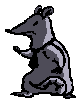

<!-- Improved compatibility of back to top link: See: https://github.com/othneildrew/Best-README-Template/pull/73 -->
<a id="readme-top"></a>
<!--
*** Thanks for checking out the Best-README-Template. If you have a suggestion
*** that would make this better, please fork the repo and create a pull request
*** or simply open an issue with the tag "enhancement".
*** Don't forget to give the project a star!
*** Thanks again! Now go create something AMAZING! :D
-->


<!-- PROJECT SHIELDS -->
<!--
*** I'm using markdown "reference style" links for readability.
*** Reference links are enclosed in brackets [ ] instead of parentheses ( ).
*** See the bottom of this document for the declaration of the reference variables
*** for contributors-url, forks-url, etc. This is an optional, concise syntax you may use.
*** https://www.markdownguide.org/basic-syntax/#reference-style-links
-->


<!-- PROJECT LOGO -->
<br />
<div align="center">
  <a href="https://github.com/AnotherSkye2/rat_rage">
    
  </a>

<h2 align="center">Rat Rage</h2>

  <p align="center">
     A single-player timed mayhem game where your goal is to vent your anger on the office furniture around you with your little, but powerful, rat fists.
    <br />
    <br />
    <a href="https://owlpun.itch.io/rat-rage">Play the Game!</a>
  </p>
</div>


<!-- TABLE OF CONTENTS -->
<details>
  <summary>Table of Contents</summary>
  <ol>
    <li>
      <a href="#about-the-project">About The Project</a>
      <ul>
        <li><a href="#built-with">Built With</a></li>
      </ul>
    </li>
    <li>
      <a href="#getting-started">Getting Started</a>
      <ul>
        <li><a href="#prerequisites">Prerequisites</a></li>
        <li><a href="#installation">Installation</a></li>
      </ul>
    </li>
    <li><a href="#license">License</a></li>
    <li><a href="#contact">Contact</a></li>
    <li><a href="#acknowledgments">Acknowledgments</a></li>
  </ol>
</details>


<!-- ABOUT THE PROJECT -->
## About The Project

![Alt text][product-screenshot]

Our team's TalTech GameCamp Lite 2024 entry, with the theme Out of Control, about a really pissed off rat. Made in 48 hours with lovely people such as Silmamunasupp, owlpun, Rotitapja, Truffle and me, AnotherSkye!


<p align="right">(<a href="#readme-top">back to top</a>)</p>

### Built With

* Unity

<p align="right">(<a href="#readme-top">back to top</a>)</p>

<!-- GETTING STARTED -->
## Getting Started

If you want to play the game, just click the link "Play the Game!" and install it on the itch.io page.
To get a local copy up and running, follow these steps.

### Prerequisites

* Unity


### Installation

1. Clone the repo
   ```sh
   git clone https://github.com/AnotherSkye2/rat_rage.git
   ```
2. Add the project in Unity Hub and open it
3. Ensure that you External Script Editor (under Edit>Preferences>External Tools) is set to your IDE of choice
4. Right-click anywhere in the Unity editor and select "Open C# Project"

<p align="right">(<a href="#readme-top">back to top</a>)</p>

### Contributors:

<a href="https://github.com/AnotherSkye2/rat_rage/graphs/contributors">
  
</a>


<!-- LICENSE -->
## License

Distributed under the MIT License. See `LICENSE.txt` for more information.

<p align="right">(<a href="#readme-top">back to top</a>)</p>


<!-- CONTACT -->
## Contact

[![LinkedIn][linkedin-shield]][linkedin-url]

Skye Hakomaa - skyehakomaa@gmail.com

My itch.io: [https://anotherskye.itch.io](https://anotherskye.itch.io)

<p align="right">(<a href="#readme-top">back to top</a>)</p>

<!-- ACKNOWLEDGMENTS -->
## Acknowledgments

* [Silmamunasupp](https://silmamunasupp.itch.io/) - Game/Level Designer
* [owlpun](https://owlpun.itch.io) - Artist
* [Rotitapja](https://rotitapja.itch.io/) - Game/UI Designer
* [Truffle](https://truffl3.itch.io/) - Sound Designer

<p align="right">(<a href="#readme-top">back to top</a>)</p>


<!-- MARKDOWN LINKS & IMAGES -->
<!-- https://www.markdownguide.org/basic-syntax/#reference-style-links -->
[product-screenshot]: README_images/rat_rage_banner.png
[linkedin-shield]: https://img.shields.io/badge/-LinkedIn-black.svg?style=for-the-badge&logo=linkedin&colorB=555
[linkedin-url]: https://www.linkedin.com/in/skye-hakomaa-0k0/